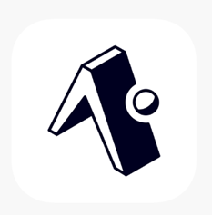

## **Project Description**

We are excited to embark on an ambitious initiative to create a mobile app designed to promote healthy living and wellness optimization through:

- Habit logging
- Fitness trackers
- Medical test analysis
- Personalized AI coaching

With a foundation in the CST program's Web and Mobile option, this app will be a fresh greenfield project iterating on an existing concept prototype called Live Timeless. Students will be encouraged to:

- Reassess and redesign this app from the ground up
- Pick an appropriate and modern tech stack
- Integrate with public APIs

This initiative will serve as a cornerstone for a broader corporate wellness program, blending financial incentives with health optimization. The goal is to empower users with actionable insights into their wellness journey, guided by:

- Fitness tracker data
- Regular blood-work
- Social groups
- A personalized AI chatbot coach
- A corporate wellness program

## **Programming Language(s)**

Students will be expected to assess the project and pick an appropriate tech stack based on the project requirements and their capabilities. There is a strong preference for modern, popular, and open-source technologies. Examples include:

- Flutter
- React Native
- Django
- Laravel

(All technologies chosen must be free and open-source)

Students will also be given the opportunity to use APIs of existing services to augment their app's capabilities. Examples include:

- OAuth / Firebase for authentication
- Apple HealthKit / Google Fit for fitness trackers
- OpenAI GPT for AI customized coaching chatbots
- Tesseract for document OCR

Additionally, students will have the chance to build their own DevOps pipeline, striving for continuous integration and deployment to the app store and to the cloud. We will be using GitHub Workflows and Actions. The use of a Mono-Repo is encouraged.

## **Hardware/Software Requirements**

Development will utilize open-source tools, with students using their own computing resources. Fitness wearables and health data will be provided as needed.

## **Current Work/Arrangement**

Transitioning from manual and fragmented wellness tracking, this project aims for a technological leap. The existing mobile app, built with React Native & Laravel, provides a valuable learning platform, but the goal is to innovate beyond its current capabilities, creating a new, more sophisticated solution. The project aims to digitize and enhance the wellness tracking process, currently reliant on manual inputs and disparate systems. By leveraging Agile methodologies and a robust DevOps pipeline, we intend to streamline development and deployment, ensuring a seamless and scalable solution.

# Build Instructions

Follow the instructions below to run the Habit Tracker mobile app in development:

Before you start, make sure your mobile device and your computer are both connected to the same Wi-Fi network.

1. Go to the App Store (if using an iOS device), or the Google Play Store (if using an Android device). Search for the “Expo Go” app and install it. The logo should look like this:

   

   Expo Go is used for running our mobile app while it is in development.

2. Go to the Habit Tracker GitHub repository at: [Habit Tracker Repository](https://github.com/Vero-Ventures/habit-tracker) and clone the project.

   > Our team assumes instructions for cloning a GitHub repository are not required.

3. Open the project in Visual Studio Code. We recommend using the “dev” branch for now. So after switching to the dev branch, please install the necessary dependencies by entering the following command in the terminal:

   ```bash
   npm i
   ```

4. After the dependencies are installed, create a .env file to hold the necessary environment variables. To do this, create a new file in the root of the project and name the file .env. Paste the provided environment variables into .env file. See the .env.example file for the environment variable names.

5. You should now have the correct environment variables file, and the necessary dependencies installed. You can now run the app by entering the following command into the terminal:

   ```
   npx expo start
   ```

   Note: If your devices are connected to a public Wi-Fi, you may need to run the command below instead:

   ```
   npx expo start --tunnel
   ```

6. If the app successfully builds, you should see a QR code displayed within the terminal. If you are on iOS, scan the QR code with your Camera app.
   If you are on Android, scan the QR code with the camera feature within the Expo Go app.

7. Give the app a few seconds to build, and you should see the mobile app running on your device.
