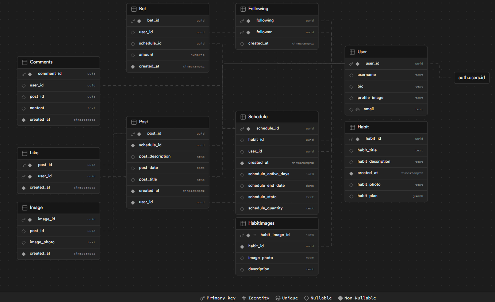

# Live Timeless

- [**Project Overview**](#project-overview)
- [**Status**](#status)
- [**Installation**](#installation)
- [Project Structure](#project-structure)
- [**Architecture and Design**](#architecture-and-design)
- [**Usage**](#usage)

# **Project Overview**

- **Description:** Live Timeless is a mobile application for IOS and Android designed to engage users in maintaining and tracking healthy habits. Live Timeless motivates consistent health habits with social engagement, helping users manage their health efficiently and potentially reduce life insurance premiums. The app streamlines health management with a user-friendly interface and AI-driven suggestions, saving time and enhancing habit adherence. This app was developed in response to the need for a more engaging and effective habit management tool.

# **Status:**

As of the latest project update (May 27th, 2024), "Live Timeless" has successfully implemented the majority of its planned features, aligning closely with our initial scope and objectives:

- **Coaching Chatbot:** Fully integrated with Google's gemini pro model, the AI coaching chatbot is operational, offering personalized plans and actionable steps to help users achieve their health goals.

- **User Account Management:** All user account management features are complete and functioning as intended, making it GDPR (General data protection regulation) compliant. This includes:

- Secure registration and login processes.
- Functionalities to delete accounts and download user data.
- Email-based authentication with enhanced security through OAuth (SupaAuth).

- **Habit Setting and Tracking**:

- Users can set and track various habit goals such as water intake and daily pushups.
- The application supports the upload of progress photos and descriptions.
- Users can create, post, view, and track the progress of their habits and see detailed reports including optional progress photos and descriptions.

- **System Performance and Scalability**:

The backend architecture, powered by Supabase, effectively handles real-time data management and user interactions, ensuring scalability and robust performance.

- **User Experience and Interface**:

The user interface is clean, intuitive, and fully responsive, designed to cater to a broad demographic across various devices and platforms.

- **Pending Implementation**:

The only two components not fully implemented as planned is the community interaction feature and instagram posting. While users can share and interact with friends' habit feeds, the broader community functionalities such as searching for and joining community groups around specific health habits are still under development. The API for posting habits to instagram also requires a few weeks for approval, ultimately causing it to fall out of scope for this project's timeline

# **Installation**

- **Prerequisites:** Make sure you have the latest version of Node.js installed
- **Setup:** Build instructions are here: https://docs.google.com/document/d/1zsOa7byMlx2hp6cp83-3GDG_W2bQ26CHtWwud7Ewx5s/edit?usp=sharing
- **Configuration:** the .env file is to be placed in the root folder and is of the following format:

- API key for Gemini
  EXPO_PUBLIC_REACT_APP_GEMINI_KEY=your_gemini_api_key_here

- Supabase URL for connecting to your database
  EXPO_PUBLIC_REACT_APP_SUPABASE_URL=https://your_supabase_url_here

- Anonymous key for accessing Supabase services
  EXPO_PUBLIC_REACT_APP_ANON_KEY=your_supabase_anon_key_here

# Project Structure

- /src: Holds most of the files making up the application
- /navigator: Contains the bottom navigation bar that helps navigate between screens
- /assets: Contains all static resources like images, logos, and icon files.
- /components: Reusable components used throughout the application. These components are mostly from the frontend of the old repo
- /screens: Contains all the individual screens of the app, each representing a different UI section.
- /services: Contains an example service for Stripe implementation (is not used in app yet since it is out of scope. It's there for future development if needed)
- /utils: Utility functions and helpers to run in the app
- App.js: The root component that houses the overall app structure.

# **Architecture and Design**

- **Technologies Used:** List of main technologies, frameworks, and libraries.

- AI-Model: Google Generative AI (Gemini Pro): This AI model is used to generate Habit plans/schedules for Users to follow to reach their health goals.

- Frontend Development: React Native (version 0.74): Is used for developing UI components which provide a seamless user experience across Android and IOS devices.

- Backend Development: Supabase (in General Availability, version 2.43.1): This is a firebase alternative that provides a database to store and sync data in real-time among users which tracks habit data. Supabase also handles backend logic and API integrations. Lastly, supabase has built-in support for authentication including OAuth.

- Emulation Framework:Expo Go (SDK 51): Will be used to emulate the app on both android and ios devices during development

# **Usage**

Below are some use cases among many for the application

Creating a habit:

- Navigate to the 'Habit' section in the app and click 'Add Habit'.
- Enter details about the habit, such as 'Habit Name' (e.g., 'Drink Water'), 'Habit Description' (e.g., 'Stay hydrated by drinking 8 glasses of water daily'), and set an 'End Date' for the habit.

Interacting with the AI Coach:

- Open the 'AI Coach' by clicking on the circle with the chatbot icon in the bottom right
- Input your current habit goals and receive guidance from Gemini AI
- The AI is accessible when creating a habit as well, click 'generate habit schedule' to see a suggestion based on the habit you're creating

Updating Posting Progress:

- Access the 'Checklist' dashboard.
- Select the habit for the day you completed the habit (this will cross it off the list).
- Navigate to the 'Timeline' and create a new post. Select the habit you did for the day
- Upload a description and progress photo optionally and submit the update.

Viewing Friend Feeds:

- Go to the 'Profile' section and select 'Find User'
- search a user by their username and press 'Follow'
- Go to the 'Timeline' tab.
- View posts from friends including their habit updates and progress photos.
- React with a heart or comment on their posts to engage with their progress.

Registering and Managing Account:

- Register for a new account by providing an email and creating a password.
- Verify your email through the link sent to your email inbox.
- Log in to access your new account.
- Click the gear icon in the top right of 'Profile' to get your data, sign out, or delete your account

## **Development**

**Pre-requisites:**

- Install the 'Expo Go' app on your mobile device to emulate the app on your phone.
- Create a .env file in the root directory and add the following environment variables:
  - EXPO_PUBLIC_REACT_APP_GEMINI_KEY=your_gemini_api_key_here
  - EXPO_PUBLIC_REACT_APP_SUPABASE_URL=https://your_supabase_url_here
  - EXPO_PUBLIC_REACT_APP_ANON_KEY=your_supabase_anon_key_here
- Install Docker Desktop to run the app in a container

### **Expo Go**

**Steps:**

1. Clone the repository to your local machine
2. Run `npm install` to install all dependencies
3. Run `npm start` or `npx expo start` to start the development server
4. Scan the QR code and open the app in the 'Expo Go' app on your mobile device

### **Docker**

**Steps:**

1. Clone the repository to your local machine
2. Run `npm install` to install all dependencies
3. Run `docker compose up --build` to build the app in a container
4. Open the app in your browser at `http://localhost:8081/`

## **Testing**

**Note:** Test cases aren't merged, but they are available in the branch 'devops/qa-tests'

**Steps**:

1. Run `npm install` to install all dependencies
2. Run `npm test` to run the test suites
3. Run `npm coverage` to run the test suites with coverage

## **Pre-Commit**

- The project uses Husky to run pre-commit hooks. The hooks include linting and formatting checks to ensure code quality and consistency.
- The pre-commit hooks run automatically before each commit. If any issues are detected, the commit will be blocked until the issues are resolved.
- Run the following command to manually run the pre-commit hooks: `npm run format`

## **Deployment**

**Steps:**

1. Run `npm install` to install all dependencies
2. Run `eas build --platform ios` to build the app for iOS
   - Fill out the required information when prompted
3. Run `eas build --platform android` to build the app for Android
   - Fill out the required information when prompted
4. Let the build process complete
5. Download the generated .apk or .ipa file and deploy it to the respective app store
   - For iOS, use the generated .ipa file to deploy to App Store Connect
   - For Android, use the generated .apk file to deploy to Google Play Console
